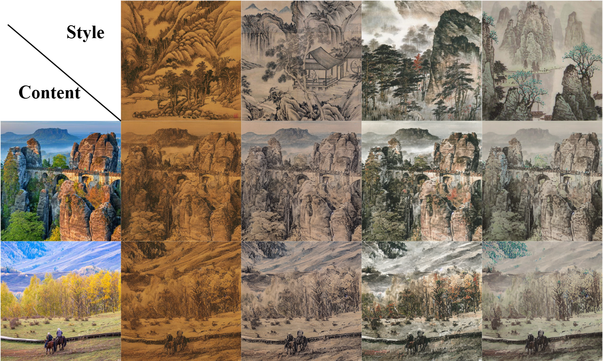

## Experiment
### Requirements
In order to run the project please install the environment by following these commands: 
```
conda create -n TMamba python=3.10
pip install -r requirements.txt
conda activate TMamba
```

### Testing
```
python main.py --content_dir ./data/cnt --style_dir ./data/sty --mode test
```

### Training  
Style dataset is WikiArt collected from [WIKIART](https://www.wikiart.org/)  <br>  
Content dataset is COCO collected from [COCO](https://www.kaggle.com/datasets/nadaibrahim/coco2014) <br>  

The partially processed dataset subset can be found at this link:[Dataset](https://drive.google.com/drive/folders/19DaE8qQNOP08hJs7ctXEnGVk8vnupZFZ?usp=drive_link)

```
python main.py --content_dir ./data/cnt --style_dir ./data/sty --mode train
```


